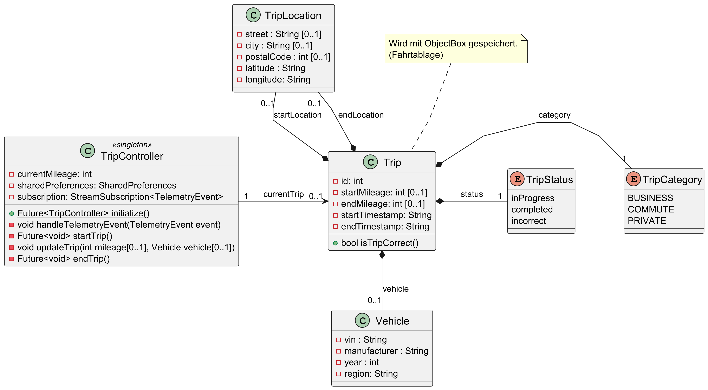

# Elektronisches Fahrtenbuch (Flutter)

Diese App ist ein elektronisches Fahrtenbuch für Android und iOS. Sie verbindet sich per Bluetooth Low Energy (BLE) mit einem OBD‑II‑Dongle (ELM327), erkennt Fahrten automatisch anhand der Bordnetzspannung, erfasst Positionsdaten und synchronisiert abgeschlossene Fahrten an einen entfernten Server.

## Funktionsumfang

- Automatische Fahrtenerkennung über Bordspannung (ATRV ≥ 13,0 V = Motor an; < 12,8 V = Motor aus)
- BLE‑Kommunikation mit ELM327: VIN auslesen (0902), fahrzeugspezifische Kilometer‑Abfrage
- Hintergrunddienst auf Android und iOS
- GPS‑Positionsbestimmung und Reverse‑Geocoding für Start/Ende
- Lokale Persistenz mit ObjectBox, spätere Übertragung per REST (x-api-key)
- Auswahl der Fahrtkategorie (z. B. dienstlich/privat) in der App

## Architektur (Kurzüberblick)

- `lib/bluetooth_task_handler.dart` (Android Foreground Service): Scan/Verbindung, Wiederverbindung, ELM327‑Setup, Telemetrie‑Loop
- `lib/ios_blueooth_service.dart` (iOS Bluetooth Service): Gleiche Funktionalität wie der Android Service nur auf iOS angepasst. (Nutzung des iOS Background Modes)
- `lib/services/elm327_service.dart`: Initialisierung (ATH1, ATSH 7E0), Kommandoversand (ATRV, 0902, fahrzeugspezifische KM‑PID), Parsen von Antworten, Publizieren von Telemetrie‑Events
- `lib/models/telemetry_bus.dart` + `lib/models/telemetry_event.dart`: Lose Kopplung zwischen BLE‑Ebene und Domänenlogik
- `lib/controllers/trip_controller.dart`: Start/Stop von Fahrten (Spannung + Inaktivität), Pflege von Fahrzeug/VIN/Kilometer, Speichern in ObjectBox und Sync
- `lib/services/gps_service.dart`: Standortbestimmung und Geocoding
- `lib/services/http_service.dart`: Endpunkte aus `.env` (LOG/TRIP/DRIVER) + `x-api-key`
- `lib/utils/vehicle_utils.dart`: VIN‑Mapping → Fahrzeugmodell → KM‑Kommando und Parser (z. B. Skoda Citigo 2016: `2210E01`)

## Voraussetzungen

- Flutter SDK (Dart >= 3.3.4)
- Android Studio (Android 10+ empfohlen) oder Xcode (iOS 14+)
- Ein ELM327‑kompatibler OBD‑II‑Adapter, der BLE anbietet

## Installation & Setup

1) Abhängigkeiten installieren
- Im Projektordner Abhängigkeiten installieren (Standard‑Flutter‑Workflow).

2) `.env` anlegen (siehe `.env.example`)
- Benötigte Variablen:
  - `TARGET_ADV_NAME`: Anzeigename des OBD‑Adapters (BLE‑Werbung)
  - `TARGET_SERVICE`: Service‑UUID des Adapters (z. B. 0000ffe0-0000-1000-8000-00805f9b34fb)
  - `LOG`, `TRIP`, `DRIVER`: HTTP‑Ziel‑URLs (optional je nach Backend‑Nutzung)
  - `API_KEY`: API‑Schlüssel für Requests (Header `x-api-key`)
  - `SKODA_CITIGO_2016_VIN`, `BMW_F21_2013_VIN`: Beispiel‑VINs für Modellzuordnung (optional/erweiterbar)
- Die Datei `.env` liegt im Projektwurzelverzeichnis und ist in `pubspec.yaml` als Asset registriert.

3) Plattform‑Konfiguration
- Android: Berechtigungen (Bluetooth, Standort, Foreground Service, Benachrichtigungen) sind in `android/app/src/main/AndroidManifest.xml` hinterlegt. Auf dem Gerät sicherstellen:
  - Benachrichtigungen zugelassen (Android 13+)
  - Standortberechtigungen erteilt (für BLE‑Scan notwendig)
  - Akku‑Optimierung für die App deaktiviert (stabiler Hintergrundbetrieb)
- iOS: In `ios/Runner/Info.plist` sind Bluetooth/Location/Background‑Modes konfiguriert. Dauerhaftes BLE‑Scanning im Hintergrund ist durch iOS eingeschränkt; zuverlässiger Autostart ist primär für Android ausgelegt.

## Nutzung

1) App starten und Berechtigungen erteilen. Auf Android wird der Bluetooth‑Dienst beim Start vorbereitet.

2) In den Einstellungen nach OBD‑Geräten scannen. Gefundene Geräte‑IDs werden an den Hintergrunddienst übertragen und für Auto‑Reconnect gespeichert.

3) Fahrtkategorie wählen. Diese Einstellung wird zusammen mit aufgezeichneten Fahrten gespeichert.

4) Automatik: Sobald die Fahrzeugspannung ≥ 13,0 V liegt und die BLE‑Verbindung stabil ist, startet eine Fahrt. Unter 12,8 V bzw. bei Inaktivität (Timeout standardmäßig 15 s) wird die Fahrt beendet. Start/Ende werden per Benachrichtigung signalisiert.

5) Synchronisation: Abgeschlossene Fahrten werden periodisch an den `TRIP`‑Endpunkt übertragen (`HttpService`, Header `x-api-key`). Bei Erfolg werden sie aus der lokalen DB entfernt.

## Fahrzeug‑/Modellunterstützung erweitern

- In `lib/utils/vehicle_utils.dart` VINs einem Modell zuordnen und je Modell das Kilometer‑Kommando sowie das Parsing definieren.
- Beispiel vorhanden: „Skoda Citigo 2016“ mit KM‑PID `2210E01` und Parser `getVehicleKmOfSkoda`.
- Weitere Fahrzeuge hinzufügen:
  - VIN im `.env` hinterlegen und in `initializeVehicleModels()` mappen
  - KM‑Kommando in `getVehicleMileageCommand()` definieren
  - Parser in `getVehicleKm()` ergänzen

## Bekannte Einschränkungen

- Kilometerstand per OBD ist herstellerspezifisch/proprietär; Beispiel für Skoda enthalten. Weitere Modelle erfordern Recherche/Implementierung.
- GPS‑Genauigkeit abhängig von Signalqualität; Betriebsdauer beeinflusst den Akkuverbrauch.
- iOS‑Hintergrundausführung limitiert; zuverlässiger Dauerbetrieb dort eingeschränkt.

Diagramme 
------
### Use-Case

### Komponentendiagramm

### Klassendiagramm

### Zustandsdiagramm

Verwandte Projekte
------------------
- Webanwendung (Datenpflege): https://github.com/tayz98/drivers_logbook_webapplication
